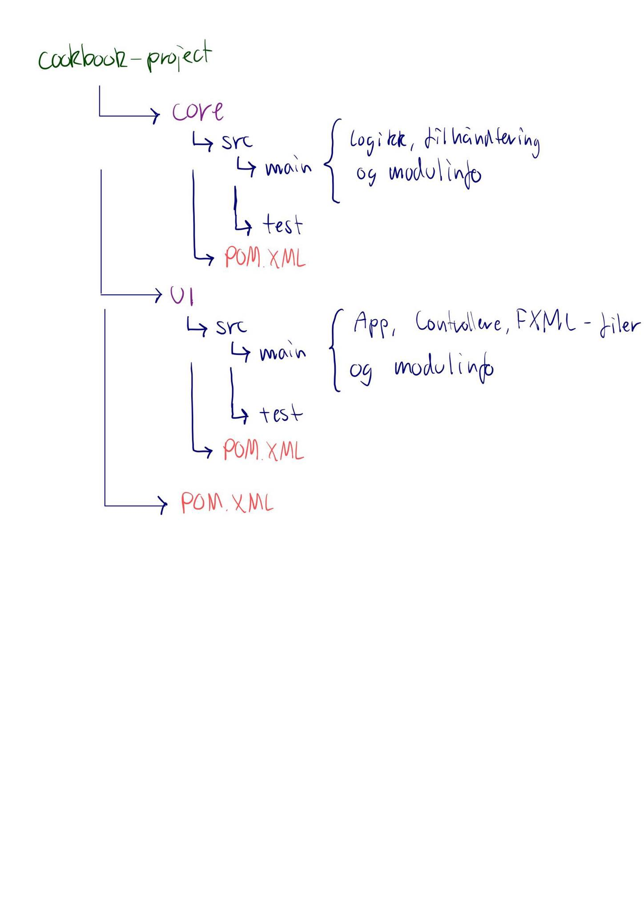

## Beskrivelse av innholdet 

Cookbook-project mappen: 

Prosjektet har to moduler; ui og core, hver av disse har en egen POM.XML som konfigurerer deres oppførsel ved kjøring med maven.

- I core-modulen er det to pakker: core og json. I core ligger logikken, altså klassene Cookbook og Recipe. Cookbook består av flere Recipe-objekter. inni json ligger en klasse som heter CookbookHandler. Denne klassen håndterer alt av lesing og skriving til json-fil av oppskriftene i kokeboken. Vi har også en testklassse under core, der vi har implementert klasser som tester at klassene fungerer som de skal.

- Videre under ui-modulen ligger to mapper kalt main og test. 
I main mappen har vi først mappen java der AppController og CookBookApp ligger:
1. AppController-klassen er en kontrollerklasse som fungerer som et bindeledd mellom brukergrensesnittet (UI) og kjernelogikken i kokebokapplikasjonen. Den håndterer brukerens interaksjoner med applikasjonen, tar imot inndata fra UI-elementer, og utfører nødvendige operasjoner for å vise og administrere oppskrifter i kokeboken. 
2. CookBookApp-klassen representerer selve kokebokapplikasjonen. Den inneholder hovedlogikken og datamodellen for å administrere oppskrifter og oppskriftsrelaterte data. Denne klassen kan inneholde metoder for å legge til, slette, søke etter, og vise oppskrifter.

Den andre mappen under main er resources, der ligger fxml filen til selve CookbookAppen. Den brukes for å definere brukergrensesnitt (UI) for JavaFX-applikasjoner. En FXML-fil beskriver strukturen og oppsettet til brukergrensesnittet ved hjelp av en hierarkisk struktur av elementer og attributter.

- Nederst i cookbook-prosjektet ligger det en tredje pom-fil som spesifiserer navnet til hele prosjektet og hvilke moduler den bruker. 

- Utenfor Cookbook-project ligger det også to md filer nederst, denne og en annen som beskriver appens virkemåte. Det ligger også et bilde som illustrasjon over appen. 

## Illustrasjon av mappestrukturen

