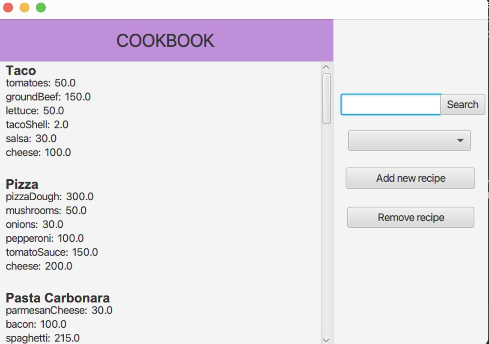

## Beskrivelse av appen og hva den er ment å gjøre 

Vårt prosjekt består av en kokebok. Denne kokeboken skal inneholde navnene på diverse oppskrifter, samt hvilke ingredienser man trenger til den tilhørende oppskriften. Videre skal appen være et verktøy som gir inspirasjon til hva man kan lage til middag. På appen sin "hovedside" kan man scrolle i oversikten over oppskrifter. Videre i løpet av iterasjonene skal vi videreutvikle appen slik at det skal være mulig å filtrerer oppskrifter basert på ulike nasjonaliteter, for eksempel italiensk eller meksikansk. Videre skal man også kunne søke etter ønskede oppskifter. 

I tillegg til dette skal det være mulig å legge til, og fjerne matretter fra kokeboka.

## Brukerhistorie

En jente som heter Kristine er på vei hjem fra skolen. Hun er student, men trenger inspirasjon til hva hun skal lage til middag denne dagen, samt hvilke ingredienser hun trenger. Hun går derfor inn i appen Cookbook og finner ut at hun vil lage en italiensk rett. Hun filtrerer ut de italienske oppskriftene og finner ut at hun har lyst til å lage spaghetti carbonara. Deretter går hun i butikken og kjøper de ingrediensene hun vet at hun mangler. Til slutt lager hun middagen ved å følge fremgangsmåten som tilhører oppskriften. 