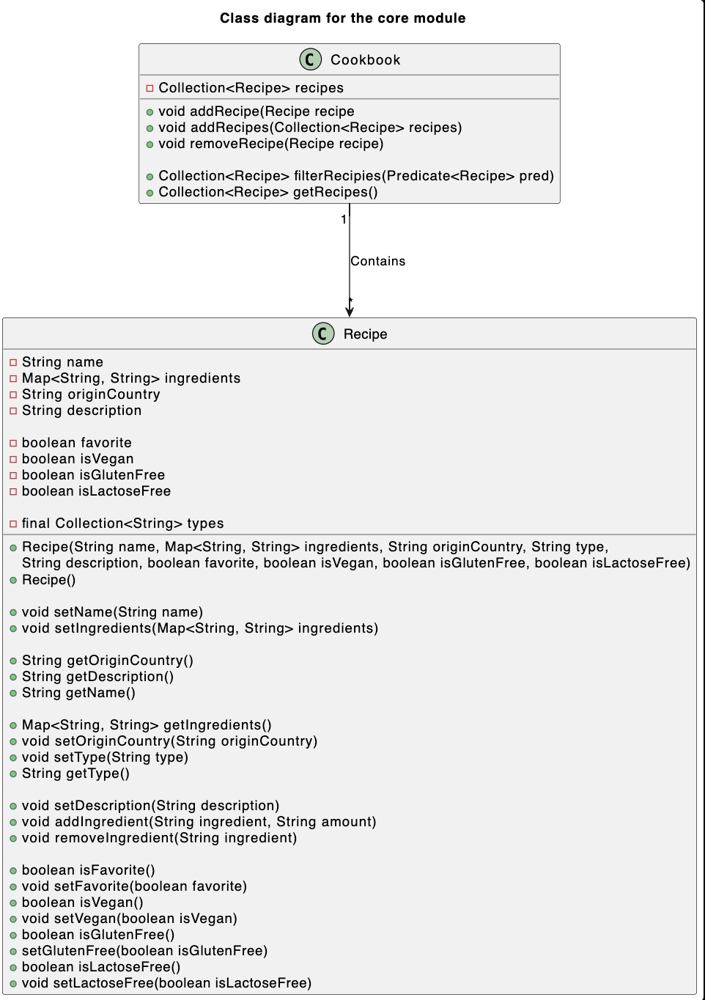

# __Core module__

The core module is responsible for the internal logic of the cookbook app, also knows as the model domain. It is responsible for the internal representation of the `Cookbook` and `Recipe` objects.

---
### _**Packages**_:
* **[cookbook.core](/cookbook-project/core/src/main/java/cookbook/core/)** - Contains the `Cookbook` and `Recipe` classes, which are the internal representation of the cookbook.

### _**Classes**_:
* **[Cookbook](/cookbook-project/core/src/main/java/cookbook/core/Cookbook.java)** - This class is responsible for the logic of the cookbook. It contains methods for adding, removing and searching/filtering recipes.
* **[Recipe](/cookbook-project/core/src/main/java/cookbook/core/Recipe.java)** - This class is responsible for the logic of the recipe. It contains methods for adding and removing for ingredients. As well as setting different properties, such as name, description, type, etc.

### _**Tests**_  
* **[RecipeTest](/gr2322/cookbook-project/core/src/test/java/cookbook/core/RecipeTest.java)** - Tests the `Recipe` class.
* **[CookbookTest](/gr2322/cookbook-project/core/src/test/java/cookbook/core/CookbookTest.java)** - Tests the `Cookbook` class.

---
### _**Class Diagram**_:

---
This module has its own pom.xml file, which is responsible for building the module with its respected dependencies and plugins, such as JaCoCo, Checkstyle and Spotbugs.

---
[< Return to _Cookbook Project_](/cookbook-project/readme.md)

