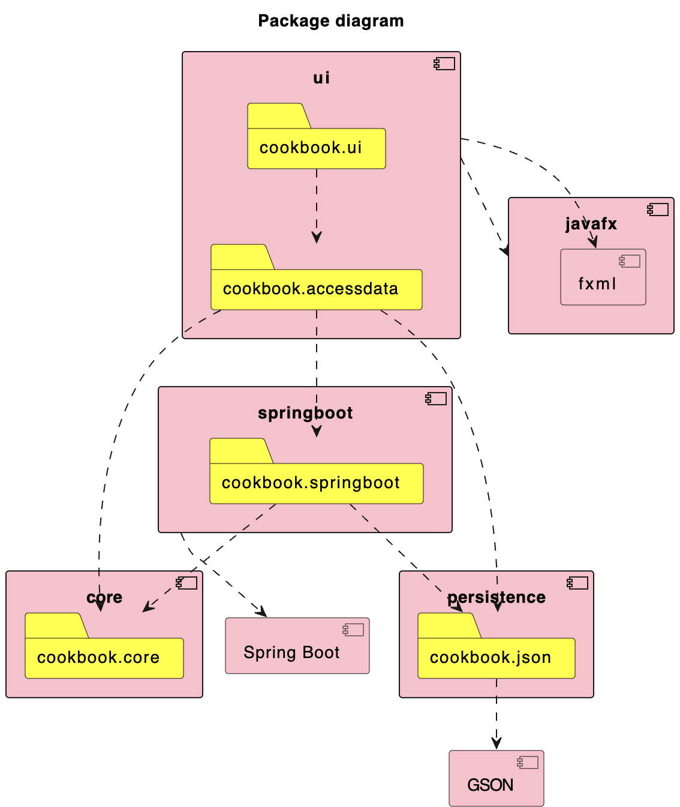
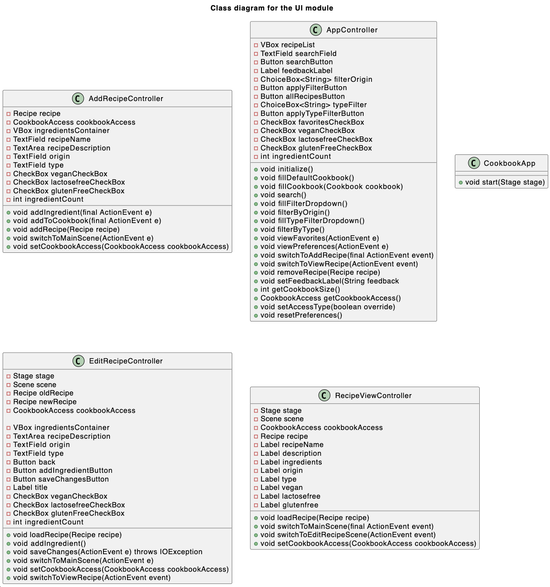

## Package diagram
A package diagram for our application. This package diagram shows how the modules interacts with eachother

## Class Diagram Core
This class diagram is an overview of the classes in the core module and shows which classes are related to eachother.

## Class Diagram UI
This class diagram is an overview of the classes in the UI module and shows which classes are related to eachother.

## Sequense Diagram
This sequense diagram shows an user adding an recipe to his cookbook. This diagram applies when the server is up and running.

