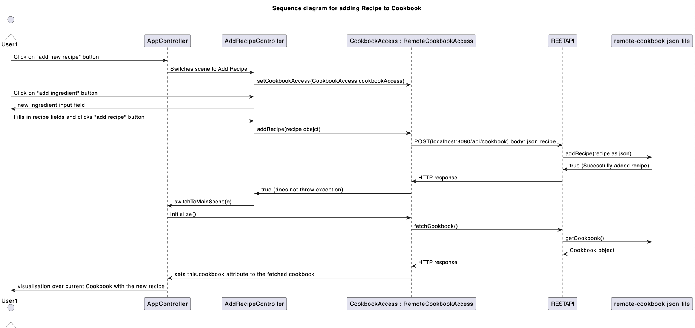
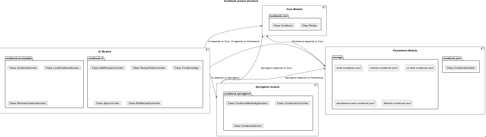

# __Cookbook-project__

## **_Project description_**

The Cookbook is an application containing recipes, along with the ingredients needed for each respective recipe. The app will provide inspiration concerning what meals to make. On the app's homepage, the user can scroll through the list of recipes. When clicking a recipe, you get a more detailed description on how to make the dish. As well as a list of ingredients needed to make the dish, the origin country, type, and preferences such as vegan, lactose and gluten- free.

The app has a search function that allows the user to search for recipes based name. The user is also able to filter by origin and type using drop-down menus. The ui contains checkboxes for filtering by preferences. A user can favorite a recipe by clicking the star icon, yellow stars indicate a favorite recipe. The user can also use the favorites checkbox to show only favorite recipes. In addition to this, users will be able to add, remove and edit recipes from the cookbook.

---
## ___Sequence diagram___
Below is a sequence diagram illustrating what happens when a user adds a recipe to the cookbook when the app is connected to the REST-API.


---

## **_How to run the app_**

```bash
# navigate to the cookbook-project directory:
% cd cookbook-project

# maven install:
% mvn clean install -DskipTests

# navigate to the ui directory:
% cd ui

# run the app
% mvn javafx:run
```
---

## **_Project Architecture_**
The the project buildt using maven.  
It has four modules; `core, ui, persistence` and `springboot`, each responsible for different parts of the applications functionality.  
As well as a `integrationtest` module for testing that the modules work together as intended. Links to the individual modules can be found below.



### ___Core___
- The core module is responsible for the internal representation of the cookbook and recipe objects.  
Read about the __core__ module [_here_](/cookbook-project/core/readme.md)

### ___UI___
- The ui module is responsible for the user interface, it is able to fetch cookboos from local files and Rest API's.  
Read about the __ui__ module [_here_](/cookbook-project/ui/readme.md)

### ___Persistence___
- The persistence module is responsible for reading and writing the cookbook to a local json file.  
Read about the __persistence__ module [_here_](/cookbook-project/persistence/readme.md)

### ___Springboot___
- The springboot module is responsible for the REST API.  
Read about the __springboot__ module [_here_](/cookbook-project/springboot/readme.md)

### ___Integrationtest___
- The integrationtest module is responsible for testing that the modules work together as intended.  
Read about the __integrationtest__ module [_here_](/cookbook-project/integrationtest/readme.md)

---
## **_Diagrams_**
Link to all diagrams related to the project [here](../docs/release3/diagrams/readme.md)

---

## Shippable product
This project is able to be shipped as a standalone application using jlink and jpackage. To ship the project, follow theese steps, assuming you have allready buildt the project.
```bash
# Navigate to the ui folder
cd cookbook-project/ui

# Jlink
mvn javafx:jlink -f pom.xml

# Jpackage
mvn jpackage:jpackage -f pom.xml

# The application installer should now be located in the ui/target/dist folder
```


---

## **_User stories_**
Read about the _user stories_ [_here_](../docs/userstories.md)

[_**<** Return to gr2322_](../readme.md)
