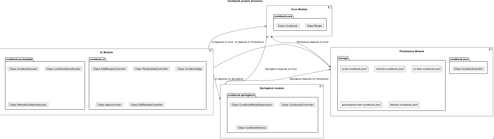

# __Cookbook-project__

## **_Project description_**

The Cookbook is an application containing recipes, along with the ingredients needed for each respective recipe. The app will provide inspiration concerning what meals to make. On the app's homepage, the user can scroll through the list of recipes. When clicking the recipes, you get a more detailed description on how to make the dish.

As we progress through the iterations, we will further develop the app to allow users to filter recipes based on different cuisines, such as Italian og Mexican. Additionally, users will also be able to search for desired recipes.

In addition to this, users will be able to add and remove recipes from the cookbook.

## **_How to run the app_**
---
```bash
# navigate to the cookbook-project directory:
% cd cookbook-project

# maven install:
% mvn clean install -DskipTests

# navigate to the ui directory:
% cd ui

# run the app
% mvn javafx:run
```
---

## **_Project Arcitecture_**
The the project buildt using maven.  
It has four modules; _core_, _ui_, _persistence_ and _springboot_, each responsible for different parts of the application. 



### ___Core___
The core module is responsible for the internal representation of the cookbook and recipe objects.  
Read about the __core__ module [_here_](/cookbook-project/core/readme.md)

### ___UI___
The ui module is responsible for the user interface, it is able to fetch cookboos from local files and Rest API's.  
Read about the __ui__ module [_here_](/cookbook-project/ui/readme.md)

### ___Persistence___
The persistence module is responsible for reading and writing the cookbook to a local json file.  
Read about the __persistence__ module [_here_](/cookbook-project/persistence/readme.md)

### ___Springboot___
The springboot module is responsible for the REST API.  
Read about the __springboot__ module [_here_](/cookbook-project/springboot/readme.md)

### ___Integrationtest___
The integrationtest module is responsible for testing that the modules work together as intended.  
Read about the __integrationtest__ module [_here_](/cookbook-project/integrationtest/readme.md)

---
## **_User stories_**

Read about the _user stories_ [_here_](../docs/userstories.md)

[_**<** Return to gr2322_](../readme.md)
