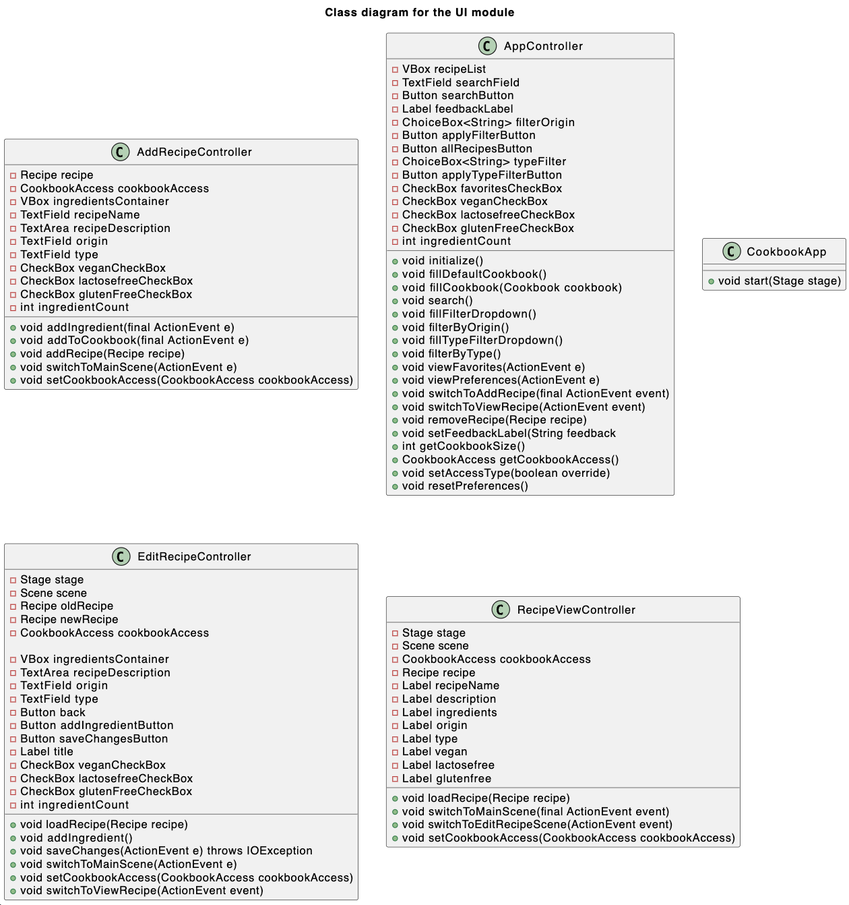

# __Ui module__

The ui module is responsible for the application's frontend. It is built using JavaFX and FXML. It uses FXML files and their respected controller for navigating between scenes. The frontend is responsible for displaying the recipes in the cookbook, adding a recipe, editing a recipe and deleting a recipe. The ui module requires access to the core, springboot and persistence module in order to function properly. It is set up to work with either a localy stored cookbook file or using requests to a REST-API.

---
### _**Packages**_:
* **[cookbook.ui](/cookbook-project/ui/src/main/java/cookbook/ui/)** - Contains the controllers for the different scenes in the application. As well as the main class for running the application.
* **[coookbook.accessdata](/cookbook-project/ui/src/main/java/cookbook/ui/)** - Contains the logic for reading and writing to the json file. This package contains two classes, one for reading and writing to a local json file and one for reading and writing to a remote json file. Both implementing the same interface for use in the controllers.

### _**Classes**_:
* **[CookbookApp](/cookbook-project/ui/src/main/java/cookbook/ui/CookbookApp.java)** - This class is responsible for running the application.
* **[AppController](/cookbook-project/ui/src/main/java/cookbook/ui/AppContoller.java)** - This class is responsible for setting up the application and switching between scenes. Linked to the [App.fxml](/cookbook-project/ui/src/main/resources/App.fxml) file.
* **[AddRecipeController](/cookbook-project/ui/src/main/java/cookbook/ui/AddRecipeContoller.java)** - This class is responsible for adding a recipe to the cookbook. Linked to the [AddRecipe.fxml](/cookbook-project/ui/src/main/resources/AddRecipe.fxml) file.
* **[RecipeViewController](/cookbook-project/ui/src/main/java/cookbook/ui/RecipeViewContoller.java)** - This class is responsible for displaying a recipe. Linked to the [RecipeView.fxml](/cookbook-project/ui/src/main/resources/RecipeView.fxml) file.
* **[EditRecipeController](/cookbook-project/ui/src/main/java/cookbook/ui/EditRecipeContoller.java)** - This class is responsible for editing a recipe. Linked to the [EditRecipe.fxml](/cookbook-project/ui/src/main/resources/EditRecipe.fxml)** file.
* **[LocalCookbookAccess](/cookbook-project/ui/src/main/java/cookbook/ui/LocalCookbookAccess.java)** - This class is responsible for reading and writing to the json file. Using the [CookbookHandler](/cookbook-project/persistence/src/main/java/cookbook/json/CookbookHandler.java) class from the [persistence](/cookbook-project/persistence/readme.md) module. Implements the [CookbookAccess](/cookbook-project/ui/src/main/java/cookbook/accessdata/CookbookAccess.java) interface 
* **[RemoteCookbookAccess](/cookbook-project/ui/src/main/java/cookbook/ui/RemoteCookbookAccess.java)** - This class is responsible for reading and writing to the json file on a remote server using the REST API from the [springboot](/cookbook-project/springboot/readme.md) module. Implements from the [CookbookAccess](/cookbook-project/ui/src/main/java/cookbook/accessdata/CookbookAccess.java) interface 

### _**Tests**_:  
* **[CookbookAppTest](/gr2322/cookbook-project/ui/src/test/java/cookbook/ui/CookbookAppTest.java)** - Tests the App using FxRobot for UI testing.
* **[LocalCookbookAccessTest](/gr2322/cookbook-project/ui/src/test/java/cookbook/ui/LocalCookbookAccessTes.java)** - Tests the LocalCookbookAccess class. 
* **[RemoteCookbookAccessTest](/gr2322/cookbook-project/ui/src/test/java/cookbook/ui/RemoteCookBookAccessTest.java)** - Tests the RemoteCookbookAccess class.

---
## **Testing the UI**
* The CookbookAppTest uses FxRobot for testing the apps GUI. It provides assurance that actions in the app lead to the correct outcome. What one presses in the app should correspond to what is expected to happen. The tests are performed by using the onClick() command with the elements' CSS ids.  
* The LocalCookbookAccessTest tests that the methods defined in the CookbookAccess interface works, and can be implemented using the CookbookHandler class from the persistence module together with some additional logic. This test ensures that we can safely use the LocalCookbookAccess object if the app fails to connect to the REST-API
* In RemoteCookbookAccessTest we use **WireMock** to mock the server, defining the expected requests and responses. This test ensures that the RemoteCookbookAccess exception handling in works as intended. This test primary focus is to ensure that the RemoteCookbookAccess throws a **RuntimeException** if it recives a non **200(OK)** response from the server. It also checks that the RemoteCookbookAccess class is able to fetch a json cookbook from the server and convert it to the right Cookbook object.

---

### _**Class Diagram**_:

---
## Important Dependecies
* __Core__
* __Persistence__
* __WireMock__

---

This module has its own pom.xml file, which is responsible for building the module with its respected dependencies and plugins, such as JaCoCo, Checkstyle and Spotbugs.

---
[< Return to _Cookbook Project_](/cookbook-project/readme.md)