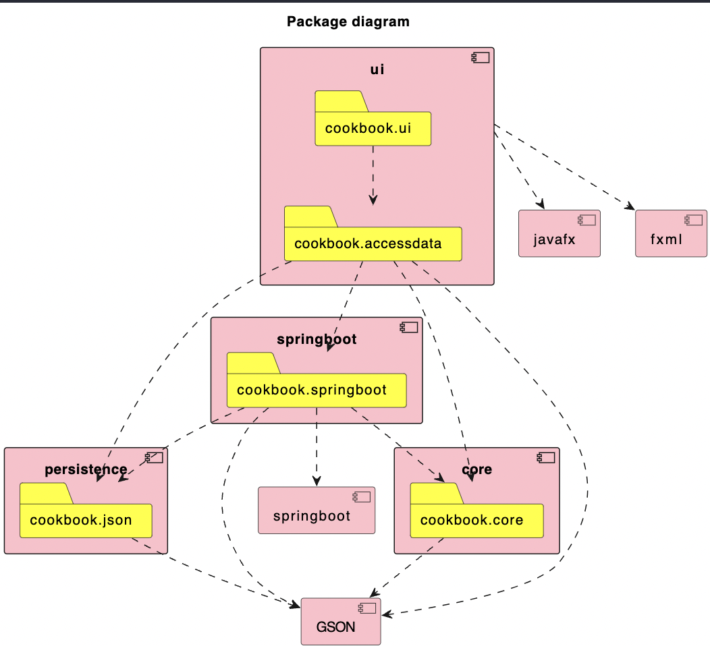
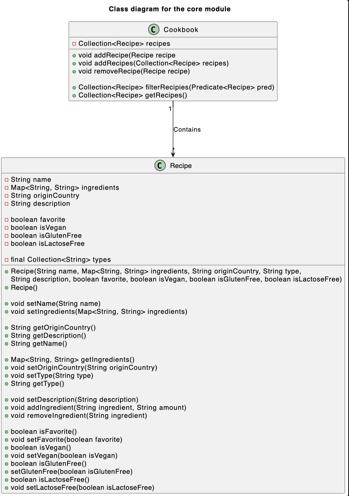
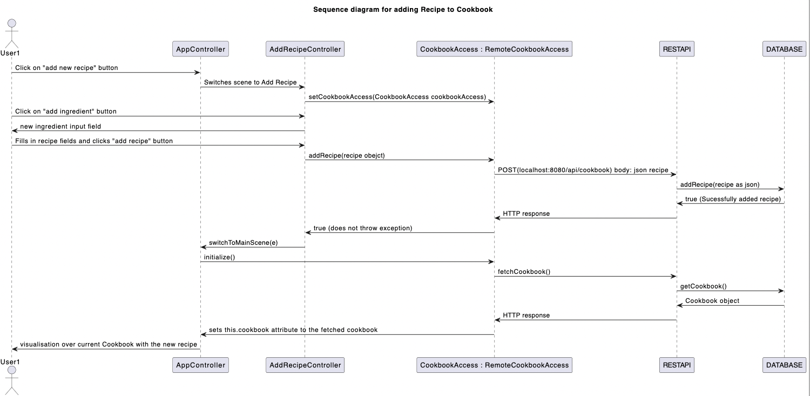

## Package diagram
A package diagram for our application. This package diagram shows how the modules interacts with eachother

## Class Diagram Core
This class diagram is an overview of the classes in the core module and shows which classes are related to eachother.

## Class Diagram UI
This class diagram is an overview of the classes in the UI module and shows which classes are related to eachother.

## Sequense Diagram
This sequense diagram shows an user adding an recipe to his cookbook. This diagram applies when the server is up and running.

## Project Structure Diagram
This diagrams shows the modules in the project, along with their dependencies. Notice that the Integrationtest module is not included, this is because its only purpose is to run an integration test, checking that the other modules work together. As excpected

