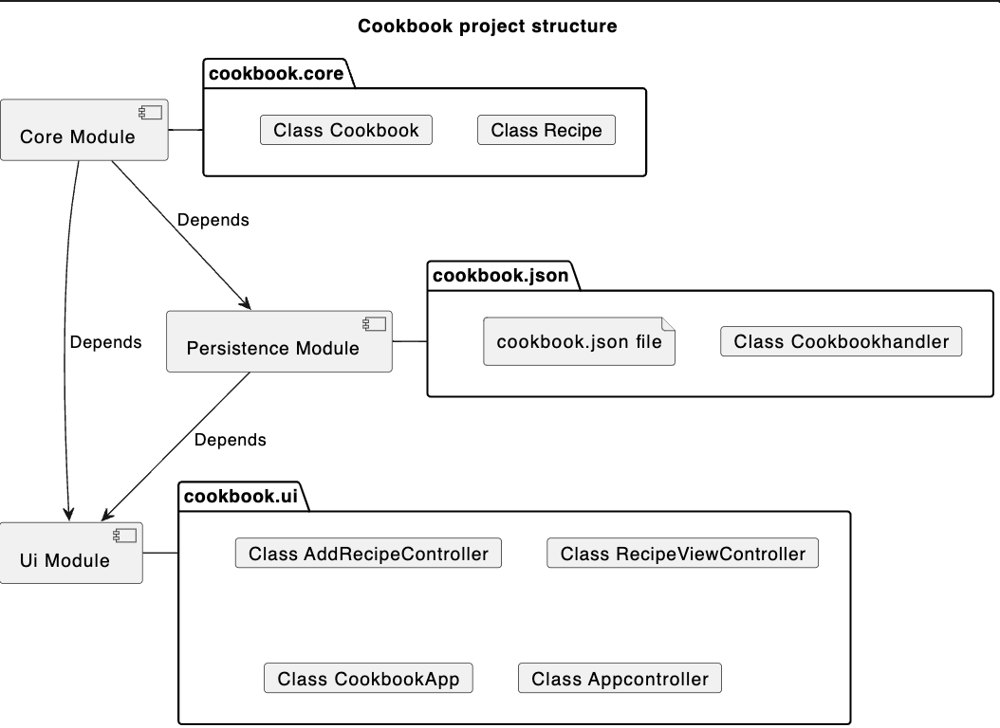

## __Release 2__

The second release extends the first release with new and refined changes to the Cookbook-app functionality. At the main scene we have made it possible to search for a specific recipe and filter by origin. We have also made a view button and remove button to all of the recipes. When the remove button of a recipe is being pressed the recipe will be removed from the cookbook and the json-file. When the user presses a view button, the scene changes to an overview of the belonging ingredients and description, to the belonging recipe. We have also added the functionality of adding new recipes when the user presses the button “add new recipe”. Then the scene will switch to the add recipe scene, where the user can write in recipe name, origin, description and decide what ingredients the recipe should contain, along with the amount of each ingredient. When the recipe gets added, the new recipe will be added to the cookbook and the json file. We have also implemented a “back” button for the add recipe scene, if the user just wants to return to the main scene. The new functionalities satisfy the user stories given in this release.

---

## __Workflow__

In this release, our team has prioritized focusing on productive work habits, achieving a significantly enhanced workflow by utilizing issues for the release. We've done so by making a milestone for each release. For the milestone we have created issues which show up as 'open', 'in progress' or 'closed' on the issue board, showcasing the tasks in progress and those that have been concluded. Each issue is assigned to its respective milestone and user story if relevant. The issues har also labeled appropriately, ensuring developers are aware of the development stage to which the issues pertain. Adopting this approach affords us several advantages. Primarily, it facilitates the allocation of developers to diverse areas of the development, enabling each member in the group to work on different type of tasks. Secondly, it provides a clear visual representation of the remaining work for each project component, potentially leading to more effective delegation within the team.

**_Brancing on issue:_**  
Moreover, each issue possesses an associated branch where we have implemented changes pertinent to that specific issue, ensuring structured and transparent traceability of modifications back to their respective tasks. Each branch is is named in following template for issue x - (user story y):  
x-(us-y-)short description. This provides a clear and logical system, whereby any adjustments or enhancements can be easily attributed and traced to their originating issues, enhancing both accountability and clarity in our developmental workflow. This also makes merging the different branches into the master branch easier, as we can easily see which branches are ready to be merged.

**_Commit messages:_**  
In programming and software development, it is essential to maintain a clear and concise log of changes, or 'commits,' in the source code. This practice allows developers to track and understand the history and development of a project. A good 'commit' message should provide clear, concise, and useful notes about what, why, and how changes have been made. We have used the following template for commit messages:

[ID] description of task done

Slightly more detailed description

Closes #issue

Co-authored by: co-author

**_Merging branches to master:_**  
We have also ensured that every merge request is reviewed by a secondary part. This layer of oversight ensures the master branch maintains its integrity and safeguarding against potential errors.

**_Pair programming:_**  
In this release, we have been pair programming. We've found that by working closely together, we have not only enhanced our collective knowledge and skills, but also gained good insight into every part of the applications functionality.

---

## __Code quality__
We have installed the SpotBugs and Checkstyle plugins to help us notice inconsistensies in our code. We have also written JavaDoc comments for methods in the core module. We have created test for all the modules. We have also used the Jacoco plugin to check the test coverage of our code. We also try to write comments in our code to make it easier to understand.

---

## __Release 2 project structure__
Here is a diagram showing the project structure at release 2:

---

## __New classes__ 

### __UI__
* `AddRecipeController`
* `RecipeViewController`

### __Persistence__
* `CookbookHandler` _(moved from cookbook.json package in core)_

---

## __Release 2 user interface__
View and remove buttons were added to each recipe pane, as well.

[_**<** Return to gr2322_](../../readme.md)
